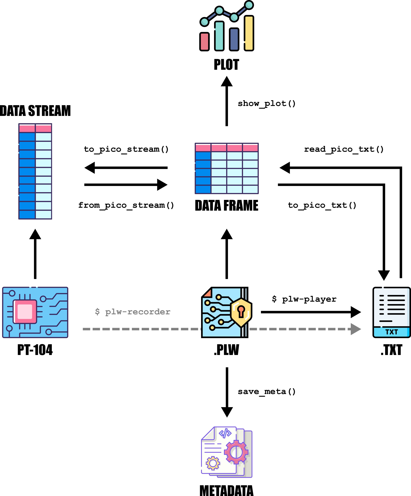

# 🎈 Basic Usage

You will find here a collection of code examples guiding you through core
 pycotech features!
 
## 📋 Working with files

Pycotech's suite of utility functions provides seamless integration of
 `.PLW` and `.TXT` files generated by traditional PicoTechnology® 
 software - allowing you to handle, visualise, and convert between 
 data-formats at will. 
 
 All of these functions are offered by the `pycotech.utils` module, and
  allow you to move between one data format and the other as shown in the
   diagram below:




```{image} ./_static/file_schema.png
:alt: file schema
:width: 200px
:align: center
```
